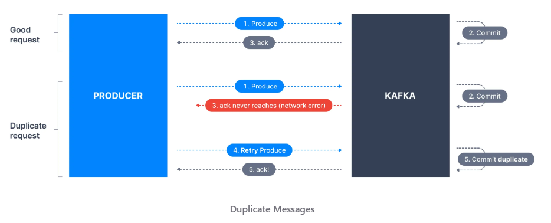
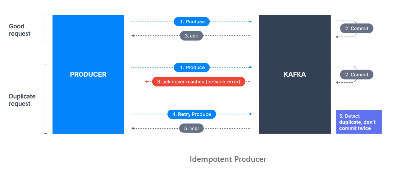

### Problem
사내 Flink 플랫폼 팀에서 취약성 이슈로 Flink 버전을 1.16 -> 1.17로 올리라는 권고가 있어 버전업을 했다.  
당시엔 KR 리전에서만 Flink 를 사용하고 있었기에 KR 만 버전업 후 배포했고 특별한 문제는 없었다.  
그 후 TW 리전에도 Flink 를 론칭을 하기 위해 동일한 바이너리로 배포했고 오류가 발생했다.
```
org.apache.kafka.common.errors.ClusterAuthorizationException: Cluster authorization failed.
```
<br/>

### Cause
원인을 찾다보니 Log 에서 idempotence 옵션을 발견했다.  
https://learn.conduktor.io/kafka/idempotent-kafka-producer/  
  
Producer 는 메시지를 발생하면 Kafka 로 부터 commit 에 대한 ack 를 받아야 한다.  
하지만 네트워크 문제등의 이유로 ack 를 받지 못하면 재시도하고 이럴경우 commit 을 중복으로 하게 된다.

이를 위해 idempotence 옵션이 추가되었다.  
  

문제는 Flink 버전을 1.16 -> 1.17 로 올리면서 kafka-clients 버전도 2.x -> 3.x 로 올라갔고,  
3.0 부터 enable.idempotence 의 default 값이 true 로 변경([Link](https://cwiki.apache.org/confluence/display/KAFKA/KIP-679%3A+Producer+will+enable+the+strongest+delivery+guarantee+by+default))되었다.  
그리고 idempotence 를 활성화하려면 IdempotentWrite 권한이 필요([Link](https://kafka.apache.org/documentation/#operations_resources_and_protocols))하다.
<br/>
<br/>

### Solution
발생한 현상을 봤을때 KR 리전의 Kafka 는 해당 옵션에 대한 권한이 있고, TW 리전에선 없는것 같다.  
이를 Kafka 플랫폼 팀에 문의했지만 답변을 못받았고, Flink 플랫폼 팀에 보고해 마이그레이션 가이드에 enable.idempotence 를 false 로 설정하도록 추가했다.  
우리 팀 Flink App 에도 enable.idempotence=false 로 변경해 배포해보니 오류는 발생하지 않았다.  

하지만 Kafka 플랫폼팀에서 KR과 TW 리전의 설정을 동일하게 맞춰야 완전한 해결이 될텐데, 찝찝하다..
<br/>
<br/>

### Lesson Learned
이번 장애는 TW 리전에서 테스트하는 단계에서 발생했는데, 오류를 바로 탐지하지 못해 다른팀까지 영향을 줬다.  
테스트 단계에서도 모니터링을 구성하도록 하자.
<br/>
<br/>
<br/>
